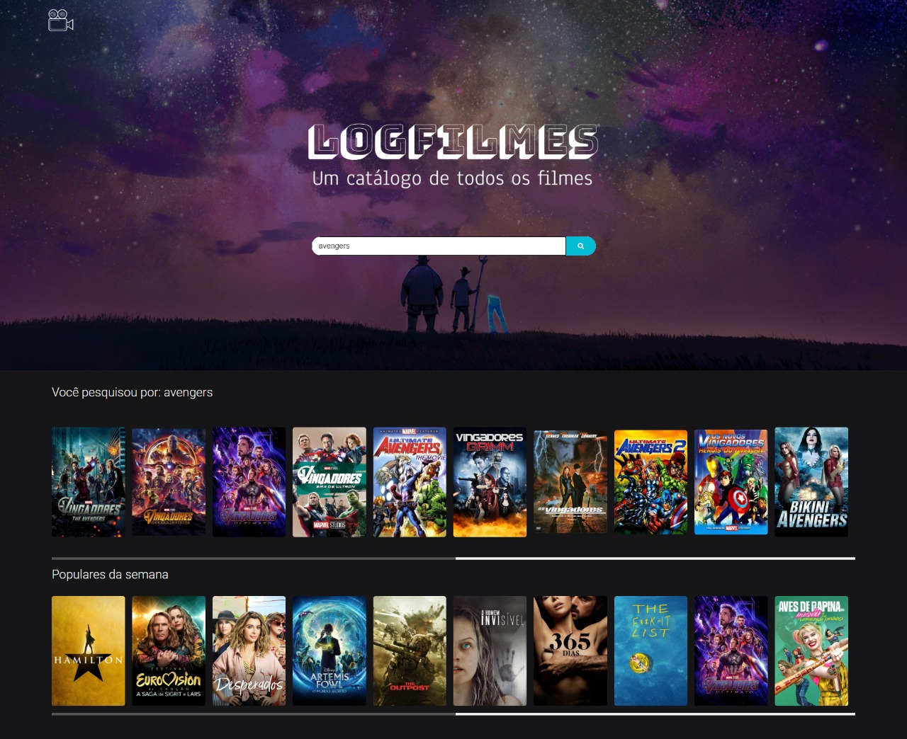
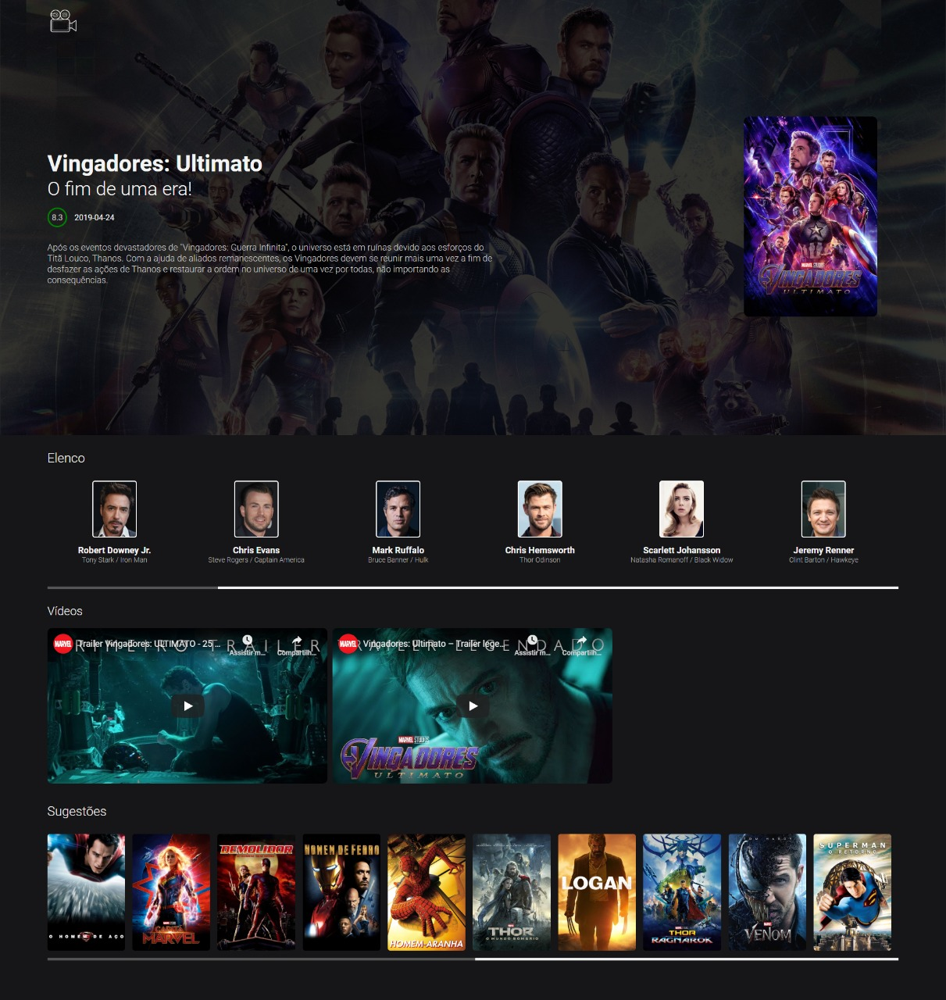

  <a href="#-projeto">Projeto</a>&nbsp;|&nbsp;
  <a href="#rocket-tecnologias">Tecnologias</a>&nbsp;|&nbsp;
  <a href="#-layout">Layout</a>&nbsp;|&nbsp;
  <a href="#memo-licença">Licença</a>

## 💻 Projeto

LogFilmes foi criado para aprofundar nos estudos de consumo de API.
Neste projeto consumo a API do The MovieDB para criar uma plataforma de buscador de filmes, nele é possivel além de fazer uma busca, na página inicial é exibido uma lista com os filmes mais populares da semana.

Clicando em um filme é exibido uma janela ao lado do poster com a sinopse e um botão para saber mais. Clicando neste botão é levado para a página dinâmica onde somente pelo ID na URL a API identifica qual é o filme e exibe na tela suas informações, como: 
 - Nome;
 - Data de lançamento;
 - Nota;
 - Sinopse;
 - Poster;
 - Os 20 principais atores/atrizes do filme;
 - Trailer;
 - E sugestões de filmes com o mesmo tema;

## 🚀 Tecnologias

 - HTML;
 - CSS (SCSS);
 - Javascript;
 - Lite Server;

## 🎨 Layout

## 📃 Licença

Esse projeto está sob a licença MIT.

---

Feito com ♥ by Emerson Leonardo